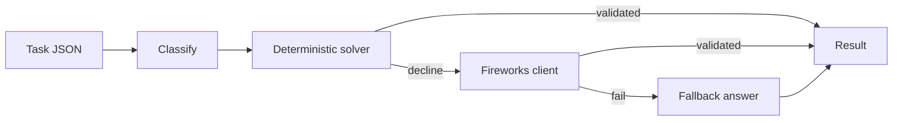

# Track 1 Router

Hybrid token-efficient routing agent for AMD Developer Hackathon ACT II Track 1.

The container reads tasks from `TASK_INPUT_PATH`, routes each task through a deterministic solver when confidence is high, escalates to Fireworks when needed, and always writes a schema-valid `RESULTS_OUTPUT_PATH`.

## Current State

This is the Phase 1 scaffold plus Phase 3-ready interfaces:

- Defensive task loading from either `[{...}]` or `{"tasks": [...]}`
- Config-only hackathon assumptions in `src/config.py`
- Conservative deterministic solvers that return `None` instead of guessing
- Fireworks client with `DRY_RUN=1` mode
- Atomic result writing and per-task stderr logs
- End-to-end unittest using sample tasks

## Unknown Official Facts

Before scoring, fill these values from the official guide or Discord:

- `ALLOWED_MODELS`
- `CHEAPEST_MODEL`
- `FIREWORKS_API_KEY_ENV`
- exact input task schema
- exact output result schema
- category labels and scoring method
- accuracy threshold
- latency limit

All of those assumptions are isolated in `src/config.py` or environment variables.

## Local Run

From this folder:

```powershell
$env:DRY_RUN = "1"
$env:TASK_INPUT_PATH = "$PWD\sample_input\tasks.json"
$env:RESULTS_OUTPUT_PATH = "$PWD\out\results.json"
python -m src.main
Get-Content .\out\results.json
```

## Tests

```powershell
python -m unittest discover -s tests
```

## Docker

```powershell
docker build -t track1-router .
docker run --rm `
  -e DRY_RUN=1 `
  -v "${PWD}\sample_input:/input" `
  -v "${PWD}\out:/output" `
  track1-router
```

## Architecture



## Category Policy

The initial policy is conservative until the eval harness proves free-path accuracy:

| Category | Free path | Default | Justification |
| --- | --- | --- | --- |
| math | safe arithmetic parser | enabled | Current dev set is 15/15 after regression fixes; ambiguous comparison questions still escalate. |
| sentiment | VADER plus conservative rules | enabled | Current dev set is 15/15; mixed strong signals, sarcasm markers, empty text, and gibberish escalate instead of forcing labels. |
| ner | spaCy PERSON/ORG/LOCATION plus regex DATE | enabled | Current Docker eval is 15/15 against official entity labels; EMAIL/MONEY/PERCENT are intentionally out of scope. |
| summarization | disabled until dev-gated | Fireworks | Extractive summaries are not enabled without measured accuracy. |
| factual knowledge | none | Fireworks | Permanent escalation-only: free factual answering risks silent wrong answers without an authoritative local knowledge base. |
| code debugging | none | Fireworks | Permanent escalation-only: deterministic local code is used only to validate model answers after the call, not to infer fixes. |
| code generation | none | Fireworks | Permanent escalation-only: no reliable deterministic generation path. |
| logical reasoning | none | Fireworks | Permanent escalation-only unless a future prompt family is explicitly approved for narrow finite-domain brute force. |
